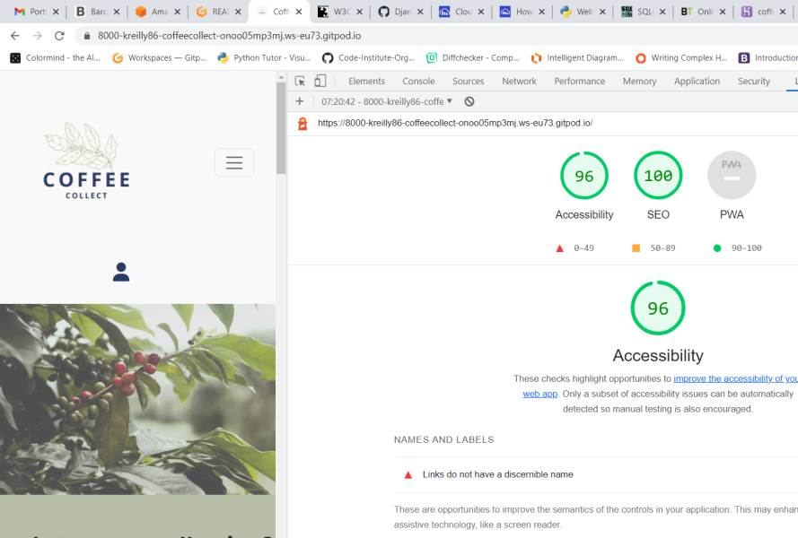

# Coffee Collect

  * [Table of Contents](#table-of-contents)
  * [UX:](#ux-)
    + [Site Owner's Goals:](#site-owner-s-goals-)
    + [User Stories](#user-stories)
    + [Wireframes](#wireframes)
  * [Features:](#features-)
  * [Design](#design)
    + [Colour Scheme](#colour-scheme)
    + [Images](#images)
    + [Navigation and menus](#navigation-and-menus)
  * [Testing](#testing)
  * [Languages, Frameworks and Libraries used](#languages--frameworks-and-libraries-used)
  * [Deployment](#deployment)
  * [Credits](#credits)
    + [Code](#code)
  * [Bugs and Errors](#bugs-and-errors)

<small><i><a href='http://ecotrust-canada.github.io/markdown-toc/'>Table of contents generated with markdown-toc</a></i></small>

# Coffee Collect

## UX:

### Site Owner's Goals:

- To provide a resource for coffee drinkers to discover more information about coffee and the regions of the world it comes from.

- To promote information sharing about the coffee distribution chain

- To allow members to add coffees to the resource database and track coffees and new trends.

### User Stories

- As a site user I want to navigate the site to easily find the information I need

- As a site user I want to search for coffees by flavour profile so that I can focus my search

- As a site user I want to be able to like/unlike specific coffees

- As a site user I want to be able to register for an account to add coffees to the database

- As a site user I want to learn more about individual coffees and their producers so I understand more about where the coffee comes from

### Wireframes

I have created wireframes for various screen sizes. 
- [Desktop View](wireframes/CoffeeCollect-desktop.pdf)

- [Mobile View](wireframes/CoffeeCollect-mobile.pdf)

- [Tablet View](wireframes/CoffeeCollect-tablet.pdf)
 
 

## Agile Model Planning

 

I used Githubs [Kanban style project board](https://github.com/users/kreilly86/projects/3) to create user stories and categorise each story as either:
    -Must Have
    -Should Have
    -Could Have
 

## Features

### Navigation

 

 
 
The navigation bar was made with bootstrap, it consists of the home page, link to coffees page,which shows the datbase entries displayed as cards. It also links to an about page, and a contribute page with further information about contributing to the database. 
 
 
I have used a font awesome user icon to the right on the navbar which drops down for users to sign-in if not already, or sign-out if already signed in.
 
The menu disappears on smaller devices but has an easy to use hamburger style menu that opens to the left. Again this was in keeping with the minimalistic and clean colour scheme of the site.
 
 

 
 

## Responsiveness

 
All pages work on mobile, tablet and larger screen sizes.

 
 

### Coffee Collect Logo

 

 
 
I created the Coffee Collect logo using canva. I was looking for a minimalistic design, which highlights the coffee plant, reminding us that the coffee we consume is from a plant, and a lot of work goes into cultivating it.
 
 

### Fonts

I used Google fonts for the project, with a mix of Fjalla, and Noto Sans. I found these sleek and simple san-serif fonts worked well with the theme of the site.
 
 

### Colour Scheme 

 

 
 

 
 
I kept the colour scheme of the site quite minimal not to distract from the message I wanted to put across. I felt like the darker blue, greys and beige fitted quite well with the photos of coffee farms and nature spread through the site.
 
 

### Images 

 

All images are taken from [Unsplash]("https://unsplash.com/")

<sm>   <a href="https://www.flaticon.com/free-icons/login" title="login icons">Login icons created by Good Ware - Flaticon</a>

Photo by Reiseuhu on Unsplash
Photo by PROJETO CAFÉ GATO-MOURISCO on Unsplash
Photo by Nathan Dumlao on Unsplash
Photo by Caelen Cockrum on Unsplash
Photo by Becomes Co on Unsplash
Photo by Devin Avery on Unsplash
Photo by Helena Lopes on Unsplash
Photo by Rodrigo Flores on Unsplash)

<a href="https://www.flaticon.com/free-icons/coffee" title="coffee icons">Coffee icons created by Freepik - Flaticon</a>
 
<a href="https://www.flaticon.com/free-icons/plant" title="plant icons">Plant icons created by Freepik - Flaticon</a>
 
<a href="https://www.flaticon.com/free-icons/peach" title="peach icons">Peach icons created by Freepik - Flaticon</a>

</sm>
 

### Home Page Carousel

 

 
 
I used bootstrap to add a carousel to the home page, which shows flaticon icons to the left. The carousel describes what the site is collecting : Producer/region, processes/variety, and flavour notes of coffees.
  
 

## Features to be Implemented

 

## Testing

- Links - I have tested the various nav bar links, and site buttons and they are all functioning correctly
- I have tested the admin portal, added entries to the database and deleted entries:
 
 

 
 

 
 
- I have tested the login and log-out functionalilty of the site, and they are functioning correctly. Users are redirected to the homepage and the dropdown account symbol indicates a user's status. The icon dropdown will guide the user to sign-out if they are signed in, or sign-in if not already.
 
 

 
 
- The user also receives a pop-up bootstrap success message after log in/ log out:
 
 

 
 

### Coffee Addition Testing

I tested adding a coffee to the database after setting up the view code and html framework for signed in users to add an entry. When the coffee entry form was submitted, I received the following error:
 
 

 
 
There was no entry with the same details on the database so I knew the entry was unique.
 
 

 
 
I found a solution here:

[stack overflow](https://stackoverflow.com/questions/50436658/how-to-auto-generate-slug-from-my-album-model-in-django-2-0-4)

 
Once I followed these intructions and imported slugify, the coffee addition function worked correctly. I then added a success message feedback so the user knows they succeeded, and a fail message if the user encounters an issue.
 
 

 
 

### Validators

 

- W3C Html validator
Site passed validation
 
 

 
 
- WSC CSS validator
 
 
https://jigsaw.w3.org/css-validator/validator?uri=https%3A%2F%2F8000-kreilly86-coffeecollect-5rcf6ubskpv.ws-eu47.gitpod.io%2F&profile=css3svg&usermedium=all&warning=1&vextwarning=&lang=en
 

- Lighthouse in google dev tools
 

 
- PEP8 Python
 
 

### Responsiveness

 

- Google Developer tools:
 
The site has been tested using Google developer tools across all break points with no issues
 
 

## Languages, Frameworks and Libraries used

 

- Python - This project uses Python as its' core language
- Django - This project is built with the Django framework
- Bootstrap - Bootstrap is used throughout the site to add style, and responsiveness to the site
- Font Awesome - Used for like symbols
- Flaticon - Used to make icons for the coffee card flavour notes
- SQLite - Was used to run the project localy
- Cloudinary - Used to host static files
- PostgreSQL - Heroku's PostgreSQL was used to store data of the deployed site

## Deployment

### Local 

 
I used Github and Gitpod to build and run this project locally. The repositiory was built using Code Institute's template:

Found [here](https://github.com/Code-Institute-Org/gitpod-full-template)

Steps:
- Click the Use This Template button in the github repository menu
- Create your own repository name, and description
- Click the Create Repository from template to create repository
- Click Gitpod to open the development environment workspace for the new respository
- Use this workspace each time, rather than repeat above steps, to ensure any installed dependencies are accessible each time
- Use git to add commit messages and push regularly to keep track of progress:

- git add . (adds all modified files to a staging area) - git commit -m "Insert explanation of commit here": commits all changes to the repository - git push: pushes all committed changes to your Github repository.
For this project I didn't use the fork or clone option in GitHub, but these are useful tools. If you want to make changes without affecting the code already pushed you can clone the workspac to work on your repository and 'test' out code and changes. On reflection this would have been a useful tool rather than making changes to the original, and sometimes getting a bit lost as to how any changes were made on one sitting.
 
 

### Heroku Deployment

 
Steps to Deploy to Heroku:
 
Sign into Heroku account and select create new app.

Choose app name and select Europe region, click create app

In local environment create a Procfile with the following:
web: gunicorn *project name here *_database.wsgi 

Click on resources tab in Heroku, and add-ons and select Heroku Postgres

Click Settings tab and select reveal Config Vars

Copy DATABASE_URL value to env.py file, and also create a SECRET_KEY here which is added as a key and value in confing vars on Heroku.

When ready to deploy under deployment tab
Select Github as deployment method and type in repository name of project

Click search and hit connect on repository name

Next hit deploy branch, and you will see "your app has been deployed", click on link to go to the deployed project

## Bugs and Errors

 

 
 
When I was building the database structure and creating an admin login superuser, I got an error message when I tried python3 manage.py runserver 
and typed in /admin/ at the end of the address bar. This was because I started the project Front End first and had been using python3 -m http.server to run my project before any of the Django elements were added. When I tried to open the admin site I had an error because I hadn't created any views or translated my site into the Django framework yet.
 
 

### db.sqlite3
 
I found out during my project that db.sqlite3 was being tracked. I have since removed this using command 'git rm -r --cached db.sqlite3'. I also reset my secret key in the local environment and on heroku.
 
 

### File path names
 
I had some file paths using incorrect naming conventions for Django:
 
 

 
 
Instead of ../static/images the path should read 
 
 

### Coffee Card Layout Issues
 
When I was working on rendering the coffee database entries, I came up against some layout issues. The page was displaying 5 coffee cards on one line even though I had specified only 3 should be in one line on desktop. I set up a forloop counter, so that the cards would show 3 to a line. I accidentally put the closing  tag in the wrong position so this didn't work. When I realised this and placed it correctly the code functioned as expected:
 
 

 
 

### Flavour Note Icons
 
I created an if/elif block to run so that when a flavour note appeared in a data entry, a corresponding icon would render in the html of the coffee card. The code ran, but for the coffee notes only one icon would appear, e.g. Peach, Cinnamon, only peach would appear. I realised it was because I was using elif and not ending the if statements. Once I ended each if statement with  and began the next one with a new if statement I was able to see both icons appear per coffee.
 
 

 
 

### Coffee Like Error
 
When I tried to create like functionality to enable users to like a coffee entry, I had an error with the entry:
 
 

 
 
The error was caused by missing code in the Coffee model:
 
 

 
 
Correct format:
 
 

 
 
Once the model was fixed, I was having issues with the Font Awesome heart icons. When the user was signed in and added or deleted likes, the font awesome icon wasn't showing beside the number of likes. I tried to change different parts of the code, and add CSS styling to the buttons, in the end I had mis-spelled the font awesome icon classes:
 
 

 
 

 
 

### Heroku Static File Error
 
When I first deployed to Heroku none of my static files loaded:
 
 

 
 
I ran the command python3 manage.py collectstatic, and none of my images or css were loading. I then installed whitenoise, and added to middleware and this fixed the issue locally. (https://stackoverflow.com/questions/35557129/css-not-loading-wrong-mime-type-django). The deployed site in Heroku still had this issue.
 
 
To fix this I installed Cloudinary, set up Cloudinary URL in the Convig Vars on Heroku and added the appropriate paths to settings.py.
 
 

### Coffee Addition Errors
 

## Credits

 

- Credit to my mentor Simon Dehlin for advice, motivation and helping for my Milestone Project 4 idea.
- Code Insitute tutorials and tutor support
- Stack Overflow
- Code Institute's Slack channel 
 

## Code

 

- Bootstrap was used for the navbar, contact form, home page carousel and scattered through the site for layout tweaking.
- Stack overflow
- The Code Institute Django blog walkthrough 

