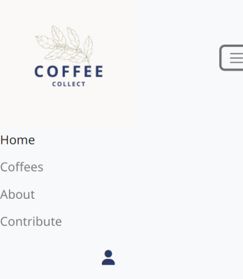
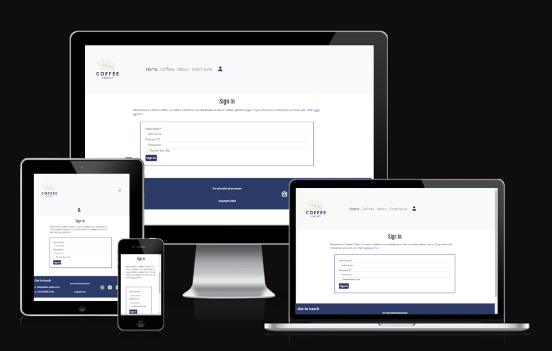

# Coffee Collect

  * [Table of Contents](#table-of-contents)
  * [UX:](#ux-)
    + [Site Owner's Goals:](#site-owner-s-goals-)
    + [User Stories](#user-stories)
    + [Wireframes](#wireframes)
  * [Features:](#features-)
  * [Design](#design)
    + [Colour Scheme](#colour-scheme)
    + [Images](#images)
    + [Navigation and menus](#navigation-and-menus)
  * [Testing](#testing)
  * [Languages, Frameworks and Libraries used](#languages--frameworks-and-libraries-used)
  * [Deployment](#deployment)
  * [Credits](#credits)
    + [Code](#code)
  * [Bugs and Errors](#bugs-and-errors)

<small><i><a href='http://ecotrust-canada.github.io/markdown-toc/'>Table of contents generated with markdown-toc</a></i></small>

## UX:

### Site Owner's Goals:

- To provide a resource for coffee drinkers to discover more information about coffee and the regions of the world it comes from.

- To promote information sharing about the coffee distribution chain

- To allow members to add coffees to the resource database and track coffees and new trends.
 

### User Stories

- As a site user I want to navigate the site to easily find the information I need

- As a site user I want to search for coffees by flavour profile so that I can focus my search

- As a site user I want to be able to like/unlike specific coffees

- As a site user I want to be able to register for an account to add coffees to the database

- As a site user I want to learn more about individual coffees and their producers so I understand more about where the coffee comes from

### Wireframes

I have created wireframes for various screen sizes. 
- [Desktop View](wireframes/CoffeeCollect-desktop.pdf)

- [Mobile View](wireframes/CoffeeCollect-mobile.pdf)

- [Tablet View](wireframes/CoffeeCollect-tablet.pdf)
 
 

## Agile Model Planning

 

I used Githubs [Kanban style project board](https://github.com/users/kreilly86/projects/3) to create user stories and categorise each story as either:
    -Must Have
    -Should Have
    -Could Have
 

## Features

 

### Navigation

 

 
The navigation bar was made with bootstrap, it consists of the home page, link to coffees page ,which shows the datbase entries displayed as cards. It also links to an about page, and a join page with further information about contributing to the database. There is also a drop down section on the navbar 'Contribute' which gives the user a choice between signing in, or signing up if they haven't already.
 

 
The menu disappears on smaller devices but has an easy to use hamburger style menu that opens to the left. Again this was in keeping with the minimalistic and clean colour scheme of the site.
 

I have also used font awesome icons to the right on the navbar which are clickable for users to sign-in if not already, or sign-out if already signed in.
 

## Responsiveness

 
All pages work on mobile, tablet and larger screen sizes.

 
 

## Features to be Implemented

## Design 

### Coffee Collect Logo
 

 
I created the Coffee Collect logo using canva. I was looking for a minimalistic design, which highlights the coffee plant, reminding us that the coffee we consume is from a plant, and a lot of work goes into cultivating it.
 

### Fonts
 
I used Google fonts for the project, with a mix of Fjalla, and Noto Sans. I found these sleek and simple san-serif fonts worked well with the theme of the site.

### Colour Scheme 
 

 
 

 
I kept the colour scheme of the site quite minimal not to distract from the message I wanted to put across. I felt like the darker blue, greys and beige fitted quite well with the photos of coffee farm and nature spread through the site.

### Images 
 

All images are taken from [Unsplash]("https://unsplash.com/")
<sm>   <a href="https://www.flaticon.com/free-icons/login" title="login icons">Login icons created by Good Ware - Flaticon</a>

(Photo by Reiseuhu on Unsplash
Photo by PROJETO CAFÉ GATO-MOURISCO on Unsplash
Photo by Nathan Dumlao on Unsplash
Photo by Caelen Cockrum on Unsplash
Photo by Becomes Co on Unsplash
Photo by Devin Avery on Unsplash
Photo by Helena Lopes on Unsplash
Photo by Rodrigo Flores on Unsplash)

<a href="https://www.flaticon.com/free-icons/coffee" title="coffee icons">Coffee icons created by Freepik - Flaticon</a>
<a href="https://www.flaticon.com/free-icons/plant" title="plant icons">Plant icons created by Freepik - Flaticon</a>
<a href="https://www.flaticon.com/free-icons/peach" title="peach icons">Peach icons created by Freepik - Flaticon</a>

</sm>
 
 

## Features to be Implemented

 

In it's present state the database is not functioning as I had intended, and some user stories have not been met yet. They are the following:
 
https://github.com/users/kreilly86/projects/3#card-82803814
 
https://github.com/users/kreilly86/projects/3#card-82803749
 
https://github.com/users/kreilly86/projects/3#card-82819886
 
https://github.com/users/kreilly86/projects/3#card-82803691
 

## Design 

## Testing

### Manual Testing

### Validators

 

- W3C Html validator
 
- WSC CSS validator
 
- Lighthouse in google dev tools
 
- Jshint Javascript
 
- PEP8 Python
 
 

### Responsiveness

 
Google Developer tools:
 
The site has been testing using Google developer tools across all break points with no issues
 
 

## Languages, Frameworks and Libraries used

 

- HTML/CSS
- Font Awesome
- Flaticon
- Javascript
- Django
- Gunicorn
- dj-database-url
- psycopg2 
- sqlparse  

## Deployment

 
Steps to Deployment to Heroku

Deployment steps here

## Bugs and Errors

 

 
When I was building the database structure and creating an admin login superuser, I got an error message when I tried python3 manage.py runserver 
and typed in /admin/ at the end of the address bar. This was because I started the project Front End and had been using python3 -m http.server to run my project. When I tried to open the admin site I had an error because I hadn't created any views or translated my site into the Django framework yet.
 
 

### db.sqlite3
 
I found out during my project that db.sqlite3 was being tracked. I have since removeds this using command 'git rm -r --cached db.sqlite3'. I also reset my secret key in the local environment and on heroku.
 

###
 

## Credits

 
- Credit to my mentor Simon Dehlin for advice, motivation and helping for my Milestone Project 4 idea.
- Code Insitute tutorials and tutor support
- Stack Overflow

### Code
 

- Bootstrap was used for the navbar, contact form, home page carousel and scattered through the site for layout tweaking.
- Stack overflow
- The Code Institute Django blog walkthrough 

